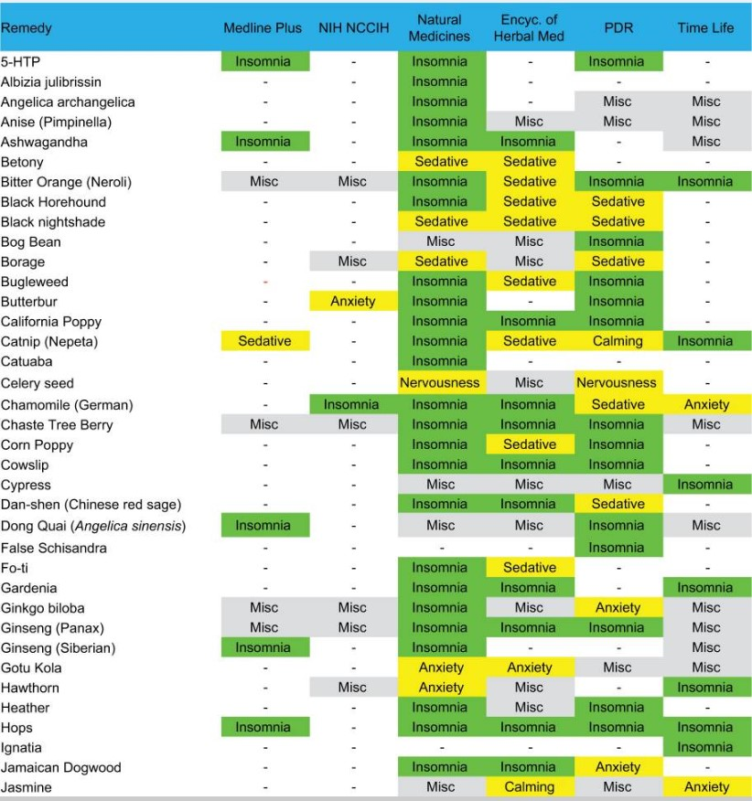

I was intrigued by this topic because few years back I read a book about sleep and was totally sold on the importance of sleep hygiene.

[Source](https://www.ncbi.nlm.nih.gov/pmc/articles/PMC5364017/)

I started off with a dataset that lists alternative remedies and whether or not they are mentioned in referenced sources as effective against insomnia. The dataset also captures whether they are mentioned for some of the related problems.

## Step 1: Identifying issues with current state
With some brainstorming, I first identified the top three issues with this visualization:

### Issue 1: Frequency of citation for each remedy
I found that it is not easy to see which remedy is cited most (or least) in the sources. I considered a reader's interest in this way of looking at the data because it provides evidence or citations for a given remedy that they (or their patients) are considering to use. If they found this article while looking for an answer to a question specific to a given alternative remedy, they probably will spend more time than needed to figure it out.

### Issue 2: Filtering by problem area
I found that it is also not easy to focus on remedies for a given problem (eg. Nervousness). Another pathway that might lead a reader into this article is if they are looking for remedies for a problem. And the existing graphic does not make this task easy at all. The reader needs to scan all over the place keeping a mental count of things, which is far from ideal.

### Issue 3: Filtering by sources
Finally, I considered the need for eliminating certain sources when trying to draw inferences from the data. Each reader probably has a different preference on sources they trust, or somehow want to include in their decision making process. Assuming this is a real need, the current graphic does not make it easy for reader to focus on data from certain sources versus others.

## Step 2: Identifying potential solutions
### Issue 1: Frequency of citation for each remedy
This class of problems could be solved quite easily by something like a bar chart, which shows the total citations for each remedy. The reader could easily compare frequencies and it allows for sorting by frequencies because the classes are nominal. However, if we just add up all citation counts into one number we loose the detail around what exactly is the remedy cited for. This might be an important detail. Therefore, I considered a [stacked bar chart](https://en.wikipedia.org/wiki/Bar_chart#Grouped_(clustered)_and_stacked) to preserve that detail.

### Issue 2: Filtering by problem area
If we were to add a simple filtering on top of a stacked bar chart, it could be handled easily too. However, I wanted to consider this separately rather than coupling it with solutions for Issue 1. For this part of the solution I wanted to make problem area (Nervousness, etc.) as one of the entry points for reader, given my anticipation of how this visualization might be used.

Another thing I considered was the relatedness of problem areas. It might make sense to show others as well (in background) even if at a time the viewer is focusing on one. Its just due to the fact that there is no standard terminology across the sources for problem area names.

In that sense its not a true filter, but more like a focus control.

### Issue 3: Filtering by sources
I kept filtering by source as lower in importance compared to the above two. Another factor I considered was that if a reader does not trust a particular source, they won't trust it for any citation. So its more like a blanket filter, which when applied we want to hide all its citations from the output visual. This could be accomplished by a selection control.

## Step 3: Concept sketch
After a few quick iterations, I liked this sketch which lays out the core idea of the solution I had in mind.

**Note:** It does not reflect the actual data, only focuses on the composition.

I planned on adding some interactivity to the visuals to provide more help and numbers under the cover that produce this chart.

## Step 4: Identifying styles specific to this dataset

## Step 5: Coding the final Solution

Some of the things I realized while implementation:
* The number of citations for a remedy are whole numbers, so showing them as discrete shapes (I chose circles) will improve readability

