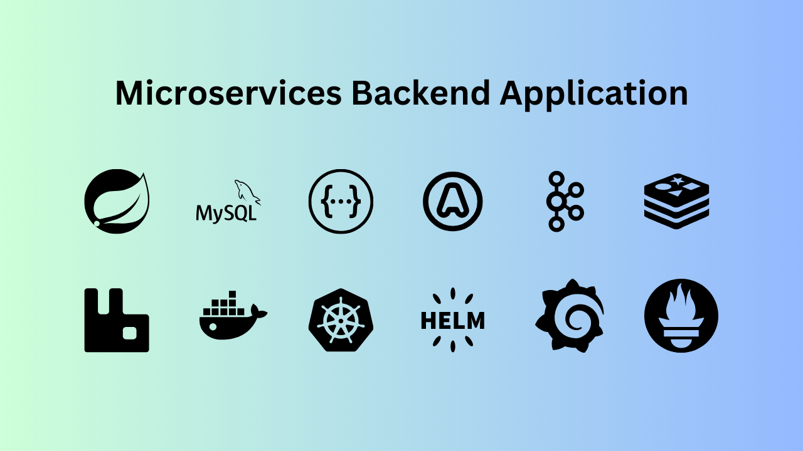

This is an application I developed while doing a course on microservices architecture, hence the fancy name. The purpose of this project is to combine together and apply best practices applicable to a large system into a small dummy application for easier analysis and demonstration. I found that in real systems, many teams work on the application and there are often gaps in comprehensive documentation of how the whole system works. By applying the principles to a much smaller application, a single person can manage to study the entire system and experiment with many design patterns, which gives them the ability to architect and work on larger systems.

# Business Context

At a high level, the business context of this application looks like the following:

As you see above, there are many users/personas that interact with the application. Below, I cover more details around how each of these users is able to interact with the application and also internal interactions between the components of the application.

# Business Services
The core business domain was implemented in three services. These are the services the end users interact with.

## Accounts service
Takes care of all customer bank accounts, along with customer information

## Loans service
Takes care of all loans information

## Cards service
Takes care of all cards information

# Infrastructure Services
As we would expect to see in any serious enterprise, the infrastructure concerns are taken care of by several separate services, which provide a lot of flexibility in extending and managing the application.

## KeyCloak Service
[KeyCloak](https://www.keycloak.org/) is an open source application that provides industry standard [OAuth 2.0](https://oauth.net/2/) and [OpenID Connect](https://openid.net/) based authentication and authorization. In demo-bank, it is deployed as a Identity Provider and Authentication server. It performs the following functions:
* Lets security admins define users, client applications and roles that can access the business application
* Issue JWT tokens to valid callers
* Expose public keys and certificates to enable Gateway server to validate incoming API requests

## Configuration Service
The Configuration Service is based on [Spring Cloud Config](https://spring.io/projects/spring-cloud-config).

All the configuration for the business and other infrastructure is maintained in a single service, which provides HTTP endpoints to fetch the configuration. It allows DevOps persona to validate and change-control all the application configuration in a centralized manner.

Additionally, to make it easy to apply the configuration changes made in configuration server to all microservices automatically without much manual intervention, I integrated with [RabbitMQ](https://www.rabbitmq.com/), which used the "Bus Refresh" design pattern to relay config changes.

## Eureka Server
The [Netflix Eureka Server](https://spring.io/projects/spring-cloud-netflix) is provided under Spring Cloud group of projects. It is an open source project that provides the ability for services to register themselves in a centralized repository, which can be accessed by clients (internal or external) to discover the IP address and port of these services. In a microservice architecture, we expect services to fail, self-heal and migrate to different hosts as a part of regular day to day operations. A discovery service like this is a critical component for everything to work.

## Observability Services
In a modern microservice application, it is almost impossible to go beyond day one if we don't have the following three capabilities setup - Observability, Distributed Tracing and Centralized Logging. In demo-bank, these capabilities are provided by setting up several services:

### Observability (Metrics)
Metrics are collected, aggregated and made searchable by [Micrometer and Prometheus](https://docs.micrometer.io/micrometer/reference/implementations/prometheus.html) connected to [Grafana](https://grafana.com/)

### Centralized Logging
Logs are collected, aggregated and made searchable using the [Grafana, Loki, Promtail stack](https://grafana.com/docs/loki/latest/get-started/quick-start/)

### Distributed Tracing
All logs have `[{appName, traceId, scanId}]` attached to them by means of global configuration using [OpenTelemetry](https://opentelemetry.io/), [Tempo](https://grafana.com/docs/tempo/latest/) and [Grafana](https://grafana.com/). This makes it possible not only to trace each requests across services, but also identify any performance or networking issues in between them by collecting timing data on each internal operation.

# Other capabilities
Other than business services and infrastrcture services, there are a few more things that needed to be done to complete the application.

## Deployment infrastructure
First off, I containerized all the services so that they can be easily deployed and consistently replicated. For this I used the excellent [Google Jib](https://cloud.google.com/java/getting-started/jib) library as most of my code is in Java.

Then, I developed [Docker Compose](https://docs.docker.com/compose/) files so that I could easily deploy the entire application on my local machine with just a single command. Tearing down entire application is similarly simplified to a single command.

Finally, to make it really ready for production deployment, I used [Kubernetes](https://kubernetes.io/) and [Helm](https://helm.sh/).

## API Documentation
The APIs exposed by business services were documented automatically into [OpenAPI](https://www.openapis.org/what-is-openapi) format using [Spring Doc](https://springdoc.org/)

## Management APIs
When services are deployed in a large system, there is usually a need for them to expose some kind of management APIs which provide other services (and humans) an ability to know when the service is up and running versus when its not ready. These APIs can be leveraged by other services to design resilience patterns to handle many common distributed system problems.

In demo-bank, production ready management APIs are exposed by [Spring boot actuator](https://docs.spring.io/spring-boot/docs/2.5.6/reference/html/actuator.html)

## Resilience patterns
When services communicate with each other, or when users communicate with servies, there is often a need to fallback or retry operations or do some other meta-business logic based on the situation. For enabling this kind of capabilities, I used [Spring Cloud OpenFeign](https://spring.io/projects/spring-cloud-openfeign) and [Resilience4j](https://resilience4j.readme.io/docs/circuitbreaker) libraries, and by combining them implemented these patterns:

* Client side load balancing
* Circuit breaker pattern
* Timeout pattern
* Retry pattern
* Rate limiting pattern

## Event-driven architecture
To demonstrate how services can send events to an externally managed queue or pub-sub platform to synchronously communicate with each other, I implemented the following:
* [RabbitMQ](https://www.rabbitmq.com/) based pub-sub model
* [Kafka](https://kafka.apache.org/) based event streaming model

For implementing both of the above, I used [Spring Cloud Function](https://spring.io/projects/spring-cloud-function) and [Spring Cloud Stream](https://spring.io/projects/spring-cloud-stream) projects, which make it super-easy to connect applications over asynchronous communication.

# Source code and additional documentation
Source code and more detailed documentation is available on [Github repo](https://github.com/vaibhav276/demo-bank)
