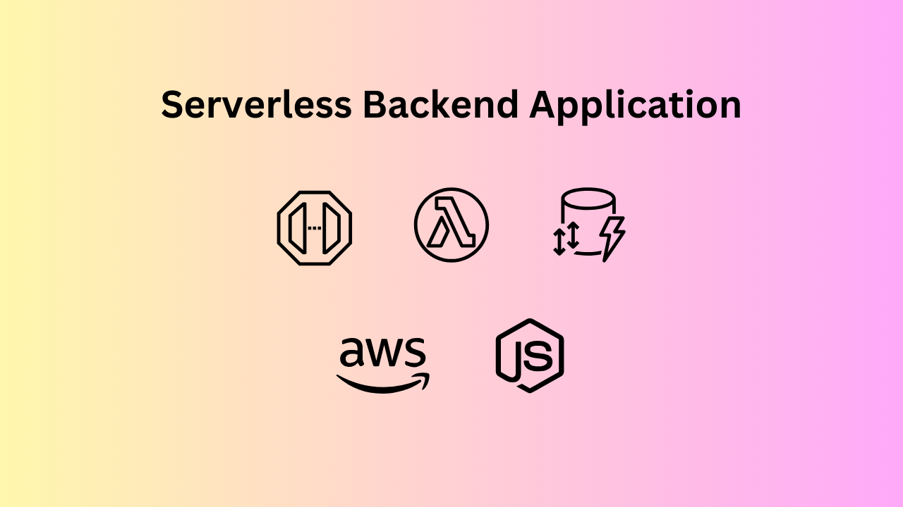

I made this application to learn about serverless lambda functions in AWS. Alongwith [AWS lambda](https://aws.amazon.com/lambda/) , I also learned about [API gateway](https://aws.amazon.com/api-gateway/) and [DynamoDB](https://aws.amazon.com/dynamodb), which are both serverless offerings from AWS. This kind of a tech stack can be an effective way to move relatively lightweight and new applications to cloud. And it is extremely cost effective.

# About
This is a demo backend application that lets users save their notes on cloud. It runs as a completely serverless application on AWS cloud. The purpose is to demonstrate a bare bones application that uses only AWS Serverless services to provide a cost-effective and scalable backend to a web or mobile frontend.

# Architecture

## Key Components
### Key-value database store: AWS DynamoDB
Notes application is well suited to a key-value pair database. An item is created for each note. The primary key is user ID and sort key is timestamp at which the note is created. [AWS DynamoDB](https://aws.amazon.com/dynamodb) is used for the key-value store database.

### Serverless Functions: AWS Lambda
The compute layer consists of individually deployable functions written in [NodeJS](https://nodejs.org/) to provide a CRUD API to the underlying data store. These functions are deployed on [AWS Lambda](https://aws.amazon.com/lambda/)

### API Gateway: AWS API Gateway
The API Gateway layer exposes REST APIs for the underlying functions. It uses [AWS API Gateway](https://aws.amazon.com/api-gateway/) to expose the APIs.

## Infrastructure
Being a serverless application, there is not much infrastructure to setup and manage. We only need to make sure that the CICD aspects of the application are well managed.

### Deployments: Serverless Framework
The [Serverless Framework](https://www.serverless.com/) provides a delivery mechanism to store entire infrastructure as code, and also deploys it using [AWS CloudFormation](https://aws.amazon.com/cloudformation) under the covers. There is only a single line command to run the entire stack locally, or to deploy it to AWS Cloud.

### CICD Pipeline: AWS CodePipeline
Additionally, CICD can be enabled as a fully automatic (and serverless) component using [AWS CodePipeline](https://aws.amazon.com/codepipeline/), which uses [AWS CodeBuild](https://aws.amazon.com/codebuild/) to trigger the commands for Serverless Framework.

# Source code and additional documentation
Source code and additional documentation can be found on the [Github repo](https://github.com/vaibhav276/demo-notes-backend) for the project.