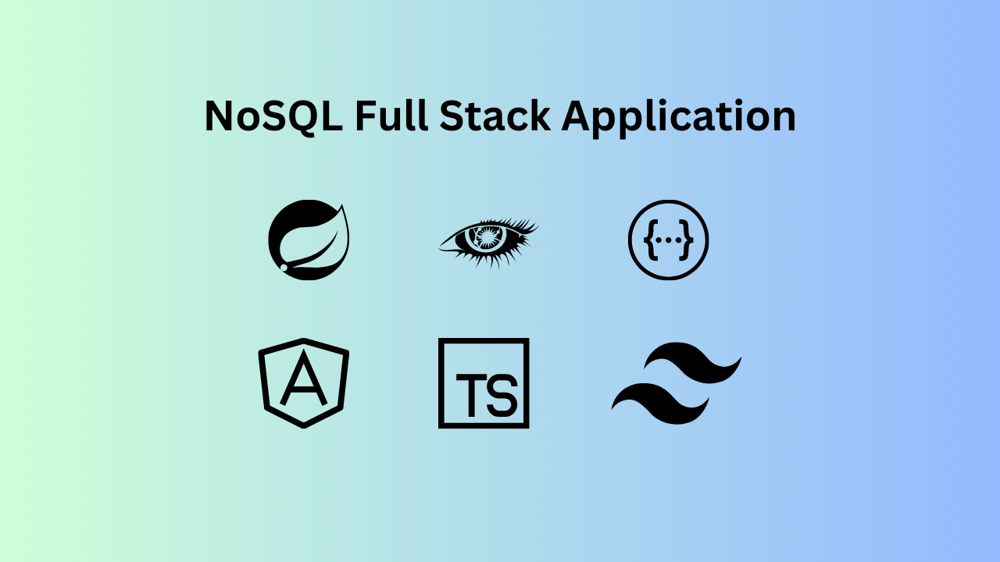
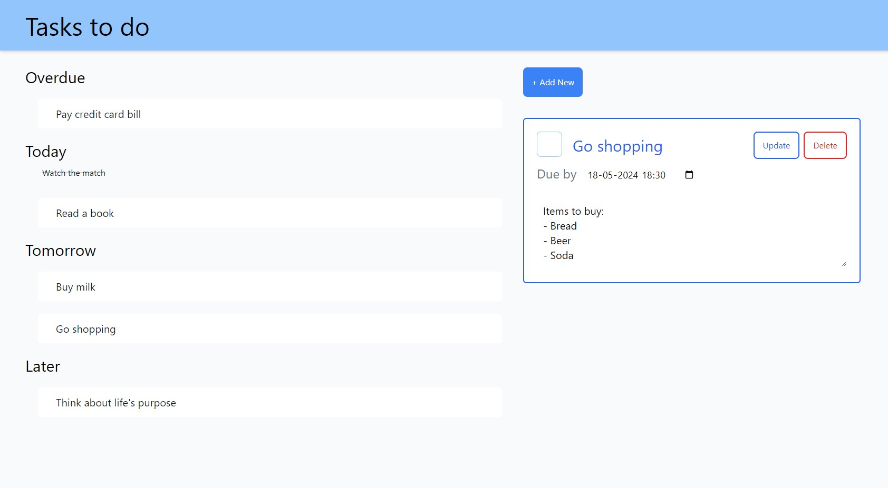
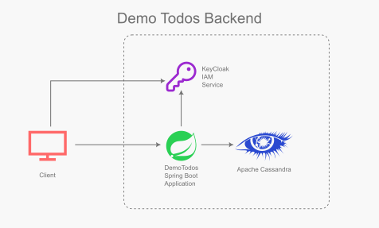

This is a simple full stack application that lets user track their Todo items.

# Architecture

## Database and stores
The application uses [Apache Cassandra](https://cassandra.apache.org/) noSQL database to store Todo items with following properties:
* `user_id` (Primary key)
* `todo_id` (Sort key)
* `due_date`
* `title`
* `description`
* `done`

Its a basic schema on which an efficient CRUD API for Todos is built.

## REST APIs
REST APIs are implemented in [Java](https://www.java.com/) using [Spring Boot](https://spring.io/projects/spring-boot).

## API Documentation
API is documented using [Open API](https://www.openapis.org/what-is-openapi) specs.

## Security
It uses [KeyCloak](https://www.keycloak.org/) as IAM server.

## Frontend
The frontend is implemented in [Typescript](https://www.typescriptlang.org/) using [Angular](https://angular.io/).
Styling is implemented in [CSS](https://developer.mozilla.org/en-US/docs/Web/CSS) using [Tailwind CSS](https://tailwindcss.com/)

# Source code and documentation
Source code and additional documentation is available on following Github repos:
* [Backend Repo](https://github.com/vaibhav276/demo-todos-backend)
* [Frontend Repo](https://github.com/vaibhav276/demo-todos-frontend)